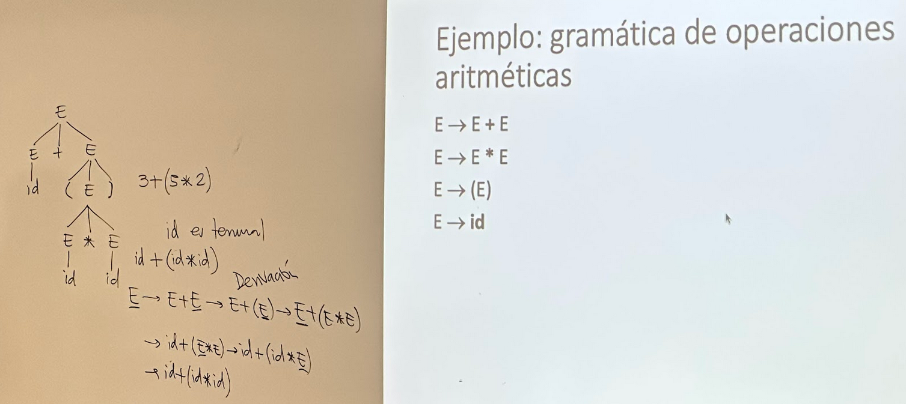

Fecha: 25 de mayo del 2026
# Gramáticas Libres de Contexto (CFG)

- Modeles formales para describir lenguajes
- Definición de sintáxis de languajes de programación (igual a la gramática en las oraciones en nuestro idioma)
- Parecidos a los conjuntos regulares
- Sintáxis se define con CFG -> Formalización de noción de parseo (traducir lenguajes de progra a machine language)
- Simplificación de traducción de programas (ej: pasar un lenguaje c++ a python) -> funciona en lenguajes de programación más no en lenguajes (español o inglés) porque para hablar son ambigüos y lenguajes de progra no son ambigüos.
- Procesar strings -> lenguajes están compuestos por strings
- Utilizadas en Algol60

*Ejemplos*

- Útiles para expresiones aritméticas y estructuras de bloque -> estos aspectos no pueden ser representados por expresiones de regulars
- Lenguajes de progra son tipo 2

*Definición informal*

- Conjunto finito de variables no terminales y cada una representa un lenguaje -> los lenguajes que representan las variables son descritos recursivamente usando otras variables.
- Para entender esto hay que entender que son las producciones.

**Producciones**

- Una regla compuesta de un string que hace una relación con una flecha con string izq con string derecho: A -> combinación de variables
- No terminales: variables sustituibles / terminales: variables no sustituibles

*Definición formal*

- CFG se denota como G=(V,T,P,S)
- V = conjunto de variables (no terminales) (parecido a estados de DFA)
- T = conjunto de terminales
- P = conjunto finito de producciones (A -> alpha) | (A es una variable no terminal) && (alpha conjunto de variables terminales y no terminales)
- S = símbolo de incio pertenece a V

> Ejemplo: 