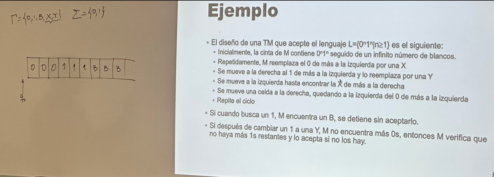
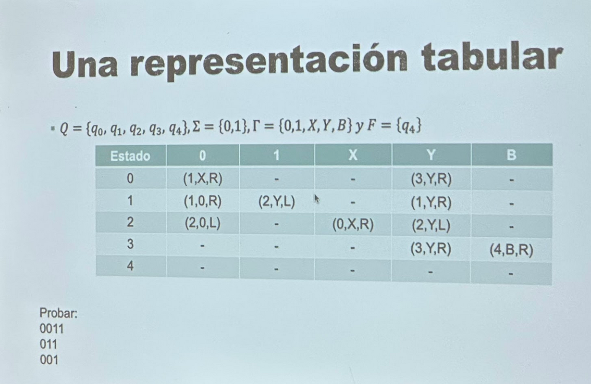

# Máquinas de Turing

- Todo problema computable se puede resolver con máquinas de turing y viceversa
- Se han convertido en la formalización aceptada de un procedimiento efectivo
- Se expresa como un algoritmo (máquina turing vs compus algoritmos son muy parecidos)

**Modelo de la máquina de turing**

* Modelo formal para Procedimineto efectivo:
- 1: cada procedimiento debe ser descrito de forma finita
- 2: debe consistir en pasos discretos (no continuos y todas nuestras compus hacen pasos discretos) -> se llevan a cabo mecánicamente

- A pasos discretos se refiere a binario o números, lectura numérica. Como en el cine las películas de cine que corren a 24 fps, no es realmente un video continuo sino una serie de fotos que son casi imperceptibles por la velocidad.

**Modelo básico**

->Tiene:

- Control finito
- Cinta de entrada que está dividida en celdas
- Una cabeza lectora de la cinta que escanea una celda de la cinta a la vez

*Descripción*
- Cinta a la izquierda tiene una celda más, pero es infinita hacia la derecha.
- Tiene memoria infinita por eso son más potentes que nuestras compus.
- Para toda n celdas a la ziquierda que sea n >= 0 y que sea finita se compone de la entrada de la máquina que es formado por un string subconjunto de símbolos iniciales.

*Funcionamiento*
1. Símbolo de entrada
2. Lee un nuevo símbolo
3. Cambia de estado (hasta acá igual que DFAs)
4. Puede reescribir el símbolo que estaba leyendo por otro
5. Se puede mover para ambos lados

- La diferencia con DFAs puede cambiar el símbolo en el que se encuentra

*Definición formal*

Máquina de turing denotada por una 7-tupla tal que: M = (Q, sigma, gamma, delta, q0, B, F)

Donde:

- Q: conjunto finito de estados
- gamma: conjunto finito de símbolos de cinta y que podemos escribir en ella
- B: símbolo de gamma, es el blanco 
- sigma: subconjunto de gamma que no incluye B, conjunto de símbolos de entrada
- delta: tabla de transiciones igual que DFAs
- q0: estado inicial pertenece a Q
- F: conjunto de estados finales, subconjunto de Q

*Descripción instantánea*

- Como tomarle una foto al estado de la máquina de turinf
- Matemáticamente, no se puede hacer eso

*Lenguaje aceptado por M*

- Lenguaje aceptado por un máquina turing (M) => L(M)
- Se acepta cuando entra en un estado final, es decir metes en el espacio blanco incial un string y llega al estado final se acepta. Cabeza lectora tiene que regresarse a la celda de la más a la izquierda
- Formalmente: {w | w está en sigma* y q0w* alpha1palpha2 para alguna p en F, y ambas alphas están en gamma*}
- Dada una M que cuando acepte un string que no haya un siguiente movimiento.
- Aquello que no sea aceptado se puede ciclar (como while loops sin n++)
- M no aceptan funciones recursivas.

*Ejemplo*

- Diseño de una M que acepta L = {0^n 1^n | n>=1}  (lenguaje libre de contexto no posible de resolver con regex):

> 

Tabla de transición:

>

