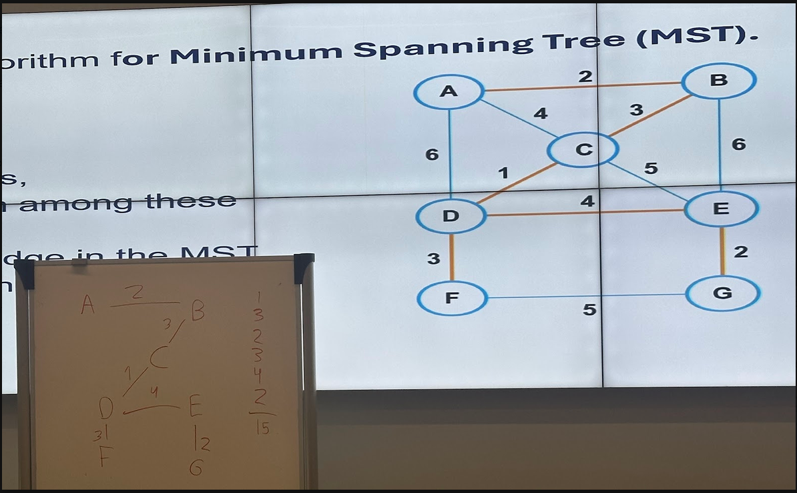
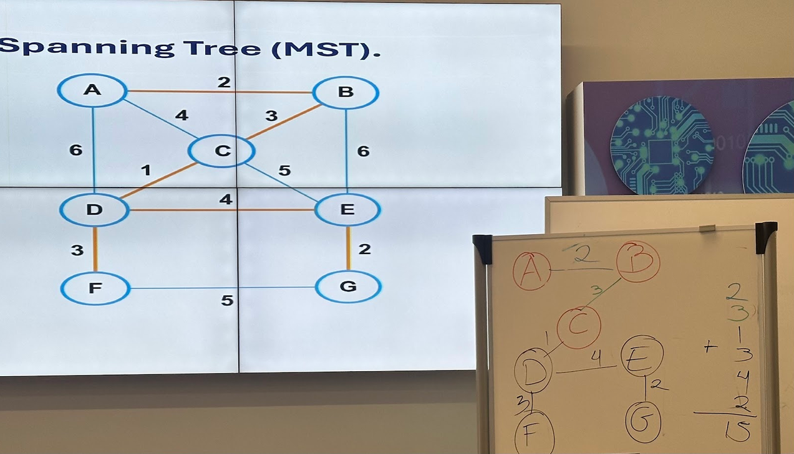

***Greedy algorithms***

**Prim´s algorithm (MST)**

Basic structre:
- Result = 0
- Select best item at the moment
- Checks feasibility of item for addition to the final result.
    if so then return it

Main idea:
- Select a node
- Analyze the edges
- Find minimum among these
- Add the chsen edge in the MST (check if theres no cycle).
- Return MST

Exercise: (Starting from C)

Exercise: (Starting from A)

- You have to check shortest edge and each time you grab more vertex, you need to check for each of the vertex you've already grabbed.
- If both vertex have the same weighted edge, you have to choose for the already visited vertex.
- You have to traverse all the vertex in the graph
- Greedy Algorithms will not give us the best possible solution. It depends on the starting vertex in this case.

**Kruskal algorithm (MST)**

Main idea:
- Sort all edges
- Pick minimum edge
- Repeat until theres V-1 edges where V represents total amount of nodes.

Exercise:

Pro tip:
- Idea is checking if you've already traverse a node in the sorted list, then you skip it. Only choose edges whose goal is reaching new nodes or if theres no connection.

**CHECK IPAD EXERCISE**
