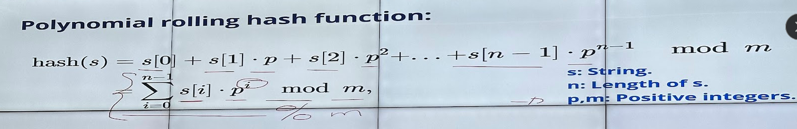

**Hash strings**

Goal: given 2 strings, check if they're same or not

-> This done by mapping each string into an integer and compare them. The reason to reduce execution time.

- Collision: when 2 strings have 

*Polynomial rolling hash function:*

- Each char of string has a value (a =1, b=2 ... z = 26)
- This so you can apply the formula or sum function.
- P is always a prime number close to the amount of elements contained in the alphabet used.
- M = 10^9 + 9

Example: (in ipad)s